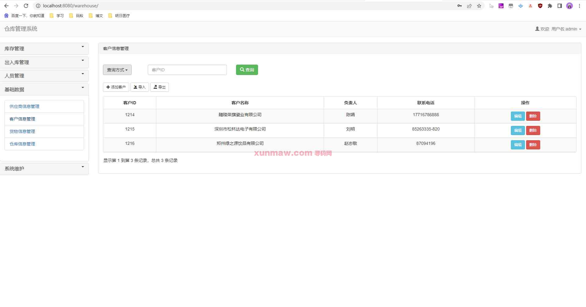

# 仓库管理系统

#### 介绍
基于JavaWeb实现的仓库管理系统，包含十三个功能模块，满足基本的仓库信息管理功能需求，稍微优化之后可以商用...

#### 软件架构
后端：spring + springmvc + mybatis  
前端：jsp + bootstrap  
环境：jdk1.8 | mysql | maven   

#### 功能介绍
##### 【代码结构与数据库截图】

##### 【功能详述】 
   1. 登录

   2. 首页

   3. 库存管理-库存查询

   4. 库存管理-库存查询

   5. 出入库管理-货物入库记录

   6. 出入库管理-货物入库

   7. 出入库管理-货物出库库

   8. 基础数据-供应商信息管理

   9. 基础数据-客户信息管理

   10. 基础数据-货物信息管理  

   11. 基础数据-仓库信息管理

   12. 系统维护-更改密码

   13. 系统维护-系统日志

   14. 系统维护-登录日志

  

#### 使用说明
1. 创建数据库，执行数据库脚本
2. 修改jdbc数据库连接参数
3. 下载安装maven依赖jar
4. 在tomcat服务器部署项目  
    请求地址： http://localhost:8080/warehouse
    用户名：admin  
    密码：123456  
